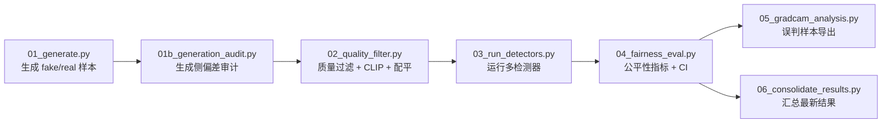

# AIGC 检测公平性评估（毕业设计）

面向 `性别 × 职业` 分组场景，评估 AIGC 检测器在不同群体上的性能差异，输出可用于论文的公平性指标与审计结果。

## 项目简介
- 研究对象：AIGC 生成内容检测中的组间公平性
- 分组设置：`male-doctor`、`female-doctor`、`male-nurse`、`female-nurse`
- 核心能力：
  - 生成侧偏差审计（数量/质量/来源）
  - 质量过滤与组间配平
  - 多检测器对比（`cnndetection` / `f3net` / `lgrad`）
  - 公平性指标评估（含 CVPR 风格指标）
  - 误判样本归因入口（Grad-CAM）

## 流程图


## 快速开始

### 1) 本地快速验证（mock）
```bash
python scripts/00_run_local_pipeline.py \
  --project-root . \
  --generator mock \
  --samples-per-group 30 \
  --real-per-group 30 \
  --detectors cnndetection,f3net,lgrad \
  --clip-min-score 0.10
```

### 2) 正式实验（fairdiffusion）
```bash
python scripts/00_run_local_pipeline.py \
  --project-root . \
  --generator fairdiffusion \
  --samples-per-group 20 \
  --real-per-group 20 \
  --detectors cnndetection,f3net,lgrad \
  --clip-min-score 0.10
```

### 3) Colab 运行
详见：[docs/COLAB.md](docs/COLAB.md)

## 结果示例
以下为一次 mock 实验输出的示意（以 `latest_run_overview.csv` 为准）：

| detector | accuracy | FM-EO(%) | FDP(%) | FFPR(%) | FOAE(%) |
|---|---:|---:|---:|---:|---:|
| cnndetection | 1.000 | 0.00 | 0.00 | 0.00 | 0.00 |
| f3net | 1.000 | 0.00 | 0.00 | 0.00 | 0.00 |
| lgrad | 1.000 | 22.22 | 11.11 | 0.00 | 11.11 |

## 关键输出
- `results/generation_audit/generation_audit.json`
- `results/fairness_tables/<detector>/overall_metrics.csv`
- `results/fairness_tables/<detector>/fairness_summary.json`
- `results/fairness_tables/latest_run_overview.csv`
- `results/fairness_tables/latest_run_notes.md`
- `results/attribution/misclassified_samples.csv`

## 目录结构（核心）
```text
scripts/
  00_run_local_pipeline.py
  01_generate.py
  01b_generation_audit.py
  02_quality_filter.py
  03_run_detectors.py
  04_fairness_eval.py
  05_gradcam_analysis.py
  06_consolidate_results.py
docs/
  COLAB.md
results/
data/
```

## 备注
- `paper/` 目录默认本地使用，已在 `.gitignore` 中忽略，不会推送。
- 若需要复现实验，请优先固定随机种子与参数配置。

## 常见报错与修复

### 1) Colab 中 `torch.cuda.is_available() == False`
- 现象：明明在 Colab，却显示 `cuda: False`
- 原因：Runtime 仍是 CPU
- 修复：
  1. `Runtime -> Change runtime type -> Hardware accelerator -> GPU`
  2. 重启会话后再次验证：
     ```bash
     python - << 'PY'
     import torch
     print("cuda:", torch.cuda.is_available())
     print("gpu:", torch.cuda.get_device_name(0) if torch.cuda.is_available() else "None")
     PY
     ```

### 2) `02_quality_filter.py` 中 CLIP 特征对象报错
- 现象：`AttributeError: 'BaseModelOutputWithPooling' object has no attribute 'norm'`
- 原因：`transformers` 新版本返回对象类型变化
- 修复：已在仓库内修复 `scripts/02_quality_filter.py`，重新 `git pull` 后再运行。

### 3) Colab 依赖冲突（Pillow 与 scikit-image）
- 现象：`scikit-image ... requires pillow>=10.1, but you have pillow 9.x`
- 原因：`semdiffusers` 依赖 `Pillow<10`
- 修复（推荐）：
  ```bash
  pip -q uninstall -y scikit-image
  ```
  `scikit-image` 非本项目必需，不影响主流程。

### 4) Windows 安装 CUDA 版 PyTorch 报 `No space left on device`
- 现象：安装 `torch==1.12.1+cu113` 时磁盘空间不足
- 原因：系统 Python 默认写入 C 盘
- 修复：使用 D 盘虚拟环境安装
  ```powershell
  python -m venv D:\venvs\bishe
  D:\venvs\bishe\Scripts\Activate.ps1
  python -m pip install -U pip
  python -m pip install torch==1.12.1+cu113 torchvision==0.13.1+cu113 -i https://mirrors.aliyun.com/pypi/simple/ --extra-index-url https://download.pytorch.org/whl/cu113
  ```

### 5) Git 推送卡住在认证
- 现象：`info: please complete authentication in your browser...` 长时间无响应
- 原因：浏览器认证未完成或终端被中断
- 修复：
  1. 完整走完浏览器认证
  2. 不要提前 `Ctrl+C`
  3. 完成后验证：
     ```bash
     git push -u origin main
     git ls-remote --heads origin
     ```
