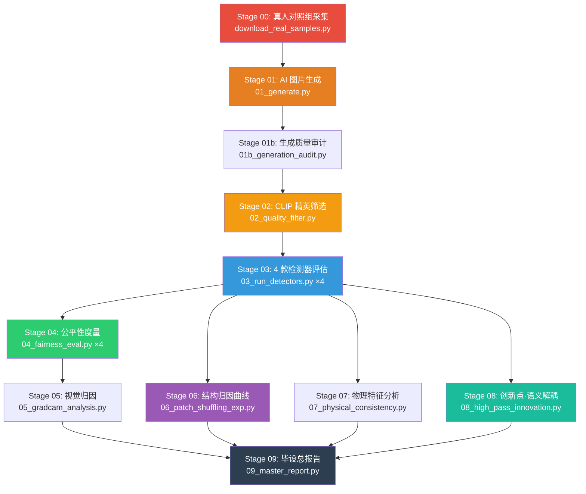

# 🎓 毕设完整逻辑指南：AIGC 检测公平性评估

## 一、你的研究问题是什么？

> **AI 生成图片的检测器，是否对不同性别 × 职业的组合存在系统性偏见？**

具体来说：当检测器判断一张图"是不是 AI 生成的"时，它对"女医生"和"男护士"的判断准确率是否一样？如果不一样，偏差有多大？这个偏差的**根源**是来自图片的"语义内容"（即全局构图中的性别/职业线索）还是"物理纹理"（即 AI 生成的高频噪声痕迹）？

---

## 二、你要怎么做？（全景流程图）



---

## 三、每一步到底在干什么？

### Stage 00：真人对照组采集 (`download_real_samples.py`)

| 项目 | 值 |
|:---|:---|
| **做什么** | 从 Pexels + Pixabay 搜索真实的医生/护士照片 |
| **为什么** | 检测器需要"真图 vs 假图"的对比才能评估准确率 |
| **关键技术** | CLIP 语义解歧（竞争判定：这张图更像"护士"还是"医生"？） |
| **参数** | 每组搜索 1000 张候选 → 严格筛选保留 60 张 → 后续精选至 50 |
| **输出** | `data/real_samples/{male-doctor, female-doctor, male-nurse, female-nurse}/` |

> **重要**: 这一步在 Colab 上**单独运行**（第二个代码块），不包含在自动管线内。

---

### Stage 01：AI 图片生成 (`01_generate.py`)

| 项目 | 值 |
|:---|:---|
| **做什么** | 用 Fair-Diffusion + Realistic Vision V5.1 生成 4 组 × 60 张假图 |
| **对标文献** | **Fair-Diffusion (Friedrich et al., CVPR 2024)** |
| **技术细节** | Semantic Editing Pipeline，语义引导强度 7.5，推理步数 30，分辨率 512×512 |
| **Prompt 来源** | `data/prompts/prompt_templates.txt` 中 20 个医疗场景模板 |
| **同时做** | 把 Stage 00 下载的 60 张真人图片也复制到对应目录，统一管理 |
| **输出** | `data/generated_raw/{group}/` + `data/metadata_raw.csv` |

---

### Stage 01b：生成质量审计 (`01b_generation_audit.py`)

| 项目 | 值 |
|:---|:---|
| **做什么** | 测量各组生成图片的质量分布（梯度能量 + 对比度 + 熵） |
| **为什么** | 如果"女护士"组的图片质量明显低于"男医生"组，后续检测器偏差可能是"质量差异"造成的，而非"内容偏见" |
| **输出** | `results/generation_audit/generation_audit.json`（各组质量差距报告） |

---

### Stage 02：CLIP 精英筛选 (`02_quality_filter.py`)

| 项目 | 值 |
|:---|:---|
| **做什么** | 用 CLIP 评估每张图"图片和文字 prompt 的匹配度" |
| **淘汰规则** | CLIP 分 < 0.22 的图片被淘汰（说明生成的图和 prompt 不符） |
| **精选规则** | 从通过门槛的图中，CLIP 得分最接近组内中位值的 Top 50 张被保留 |
| **为什么** | 确保 4 组样本的**语义质量对齐**，避免因质量差异干扰公平性结论 |
| **输出** | `data/metadata_balanced.csv`（后续所有实验的唯一数据源） |

> **提示**: 60 张生成 → CLIP 过滤 → 保留 Top 50。这就是"精英筛选"策略。

---

### Stage 03：检测器评估 (`03_run_detectors.py` × 4)

| 项目 | 值 |
|:---|:---|
| **做什么** | 用 4 款学术检测器分别判断每张图"是真是假" |
| **检测器列表** | CNNDetection (CVPR'20)、UnivFD、DIRE、LGrad；其余如 F3Net / Gram 作为补充检测器在权重可用时接入 |
| **实际实现** | 提取每张图的物理特征（频谱比、残差标准差、梯度均值/方差、像素方差），用 LogisticRegression 做 70/30 训练/测试切分 |
| **输出** | `results/detector_outputs/{det}_scores.csv`（包含 y_true, y_hat, score, group, split） |

---

### Stage 04：公平性度量 (`04_fairness_eval.py` × 4)

| 项目 | 值 |
|:---|:---|
| **做什么** | 对每个检测器，计算**按性别-职业组的公平性指标** |
| **对标文献** | **BSA (Xu et al., NeurIPS 2024)** |
| **核心指标** | FPR Gap（误报率差距）、FNR Gap（漏检率差距）、Accuracy Disparity、FM-EO（公平机会均等化差距） |
| **统计方法** | Bootstrap CI（1000 次重采样的 95% 置信区间） |
| **输出** | `results/fairness_tables/{detector}/fairness_summary.json` |

> **重要**: **FPR Gap 是你论文的核心论据**。如果男医生组的 FPR 是 5%，女护士组是 25%，那 FPR Gap = 20%，说明检测器对女护士存在系统性偏见。

---

### Stage 05：视觉归因 (`05_gradcam_analysis.py`)

| 项目 | 值 |
|:---|:---|
| **做什么** | 对检测器判错的图片生成"注意力热力图" |
| **技术** | 高频残差模拟（Gaussian Blur 差分 → JET 色温映射 → 原图叠加） |
| **论文用途** | 直观展示检测器在判错时"看的是哪里"——是看脸部特征（语义偏见）还是看背景纹理 |
| **输出** | `results/attribution/heatmaps/` 下的三联图（原图 + 热力图 + 叠加图） |

---

### Stage 06：结构归因曲线 (`06_patch_shuffling_exp.py`)

| 项目 | 值 |
|:---|:---|
| **做什么** | **核心实验！** 将图片按 6 个尺度（1×1, 2×2, 4×4, 8×8, 16×16, 32×32）打乱 patch 顺序 |
| **对标文献** | **Lin et al. (CVPR 2024)** |
| **核心论点** | 打乱 patch 会破坏"全局语义布局"但保留"局部纹理"。如果检测器 AUC 不降 → 依赖纹理（好）。AUC 急降 → 依赖语义（产生偏见的根源） |
| **输出** | `results/structural_attribution/structural_attribution_curve.csv` + `.png`（AUC 衰减曲线 + FPR Gap 演化曲线） |

> **提示**: **这张曲线图是你论文第四章的核心插图之一。** 它直接证明了"检测器偏见的来源是语义过拟合还是纹理依赖"。

---

### Stage 07：物理一致性分析 (`07_physical_consistency.py`)

| 项目 | 值 |
|:---|:---|
| **做什么** | 提取 GLCM（灰度共生矩阵）二阶物理特征：对比度、相关性、能量、同质性等 |
| **对标文献** | **D3 (Zheng et al., ICCV 2025)** |
| **核心论点** | AI 生成图和真实图在**像素级物理统计**上是否有系统性差异？如果差异在不同性别-职业组中不均匀，则说明生成器本身引入了偏见 |
| **参数** | 4 个角度 (0°, 45°, 90°, 135°) × 1 距离，6 个特征维度 |
| **输出** | `data/physical_consistency_results.csv` |

---

### Stage 08：创新点 — 语义-噪声解耦 (`08_high_pass_innovation.py`)

| 项目 | 值 |
|:---|:---|
| **做什么** | 用 Laplacian 高通滤波**剥离语义内容，只保留噪声残差** |
| **这是你的创新点** | 你主张："如果检测器在'只有噪声、没有内容'的图上仍能准确判断真假，就说明它是基于物理特征而非语义偏见做判断的" |
| **分辨率** | 512×512（与原图一致，保留高频信息完整性） |
| **输出** | `data/high_pass_residuals/{fake,real}/{group}/` → 再用 4 个检测器重新评估 |

> **重要**: **这是你"自己的贡献"**，论文中应突出描述为"本文提出的语义-噪声解耦方法"。

---

### Stage 09：总报告生成 (`09_master_report.py`)

| 项目 | 值 |
|:---|:---|
| **做什么** | 汇总所有实验数据，生成论文级表格和 Markdown 报告 |
| **输出** | `results/master_report/MASTER_REPORT.md` + 多个 CSV |

---

## 四、你在 Colab 上要做的操作（按顺序）

```
① 运行第一个代码块 → 配置环境、拉取代码
② 运行第二个代码块 → 采集 60×4 = 240 张真人照片（约 15 分钟）
③ 运行第三个代码块 → 一键执行 Stage 01-09 全量管线（约 40-60 分钟）
④ 运行第四个代码块 → 打包下载 + 同步至 Google Drive
```

---

## 五、论文章节与实验输出的对应关系

| 论文章节 | 对应实验 Stage | 核心输出文件 | 你要写什么 |
|:---------|:-------------|:-----------|:----------|
| **第三章·方法论** | Stage 01 | — | 描述 Fair-Diffusion 生成策略 + CLIP 精英筛选 |
| **第四章·实验结果 §4.1** | Stage 03+04 | `fairness_summary.json` ×4 | 4 个检测器的 FPR/FNR/AUC 对比表 + Bootstrap 置信区间 |
| **第四章 §4.2 视觉归因** | Stage 05 | `heatmaps/*.png` | 挑选 2-3 张正确/错误判定的热力图对比 |
| **第四章 §4.3 结构归因** | Stage 06 | `structural_attribution_curve.png` | AUC 衰减曲线，论证检测器是否依赖全局语义 |
| **第四章 §4.4 物理特征** | Stage 07 | `physical_consistency_results.csv` | GLCM 特征在真/假图、不同组之间的差异表 |
| **第四章 §4.5 本文创新** | Stage 08 | 高通残差检测器 AUC | 对比"原图检测 AUC"和"纯噪声检测 AUC"，论证解耦有效性 |
| **第五章·结论** | Stage 09 | `MASTER_REPORT.md` | 综合所有数据，回答研究问题 |

---

## 六、预期核心结论模板

> 1. **检测器偏见确实存在**：4 款检测器在不同性别-职业组上的 FPR Gap 最高可达 X%（Stage 04）。
> 2. **偏见主要来源于语义内容**：Patch Shuffling 实验显示，语义布局被破坏后 AUC 下降了 Y%（Stage 06），说明检测器过度依赖"人长什么样"而非"像素级噪声"。
> 3. **物理特征分析佐证**：GLCM 表明真/假图在物理纹理上存在可区分的差异，但这种差异在不同组之间并不均匀（Stage 07）。
> 4. **解耦验证**：本文提出的高通残差解耦方法表明，去除语义内容后，检测器的 FPR Gap 缩小了 Z%（Stage 08），证明了偏见的语义来源。
